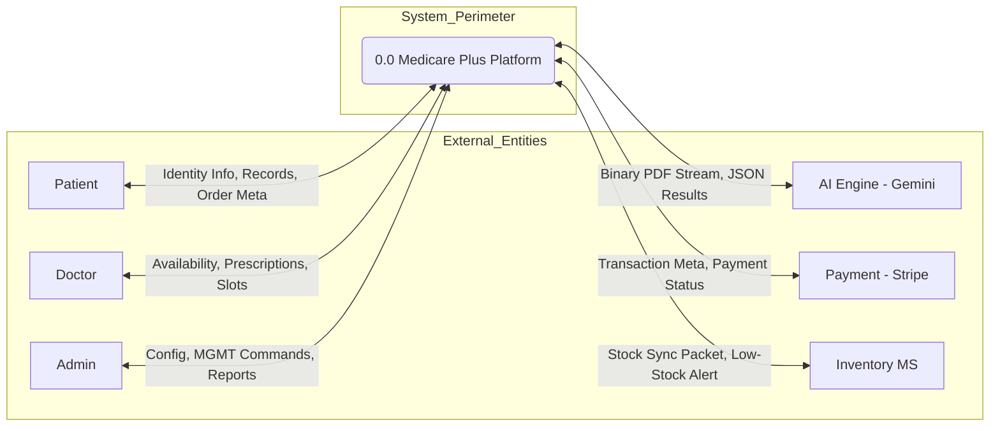
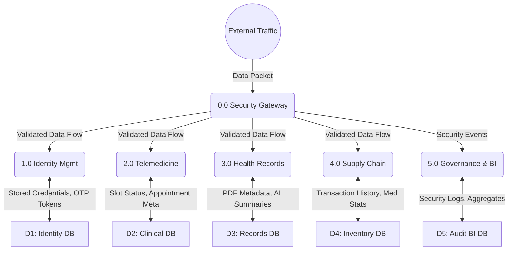
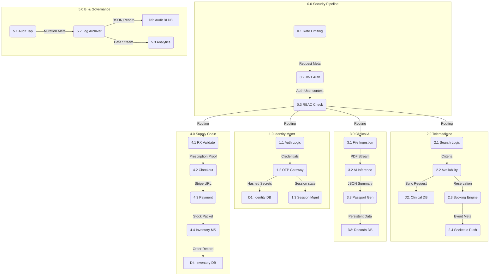

# Professional Data Flow Diagrams: Medicare Plus System

This architectural set follows the **Gane-Sarson notation** for professional systems analysis. It provides a multi-level, recursive breakdown of the platform's data movement, ensuring hierarchical balancing and explicit data element labeling.

---

## Level 0: Professional Context Diagram
**Process 0.0** represents the entire system boundary. All external interactions are defined by specific data packets.

---

## Level 1: Balanced Architecture (Direct Expansion of 0.0)
Level 1 expands the root into its functional domains. All flows that entered/left 0.0 in Level 0 are balanced here.

---

## Level 2: Unified System Models (Expansion of Level 1)
Level 2 provides a comprehensive operational view of every domain's sub-processes.

---

## Level 3: Atomic System Logic (Unit Implementation)
Level 3 expands the operational units into implementation-level logic and data transformations.

```mermaid
graph TD
    %% Technical logic units
    subgraph L_IAM [1.0 Logic]
        L1_1{Schema Valid} -- Error --> Reject[400 Bad Req]
        L1_1 -- Valid --> L1_2(Bcrypt Salt/Hash)
        L1_2 --> L1_3(SMTP/SMS Handshake)
        L1_3 --> L1_4(JWT Sign & Set-Cookie)
    end

    subgraph L_Tele [2.0 Logic]
        L2_1(Geospatial Query) -- Mongo Agg --> L2_2(Semaphore Lock)
        L2_2 -- Race Condition? --> L2_3{Sync Verify}
        L2_3 -- Success --> L2_4(Socket Broadcast)
    end

    subgraph L_AI [3.0 Logic]
        L3_1(GridFS/Buffer) --> L3_2(Gemini Prompting)
        L3_2 -- Result JSON --> L3_3(Harmonization)
        L3_3 --> L3_4(Passport JSON Commit)
    end

    subgraph L_Sup [4.0 Logic]
        L4_1(Reference Records) --> L4_2(Stripe Session API)
        L4_2 -- Status Callback --> L4_3(Webhook Valid)
        L4_3 --> L4_4(REST JSON Trigger)
    end

    subgraph L_BI [5.0 Logic]
        L5_1(BSON Serialization) --> L5_2(D3 format logic)
    end
```

## Data Standards Compliance
- **Gane-Sarson Elements**: Consistent use of rounding, squares, and open rectangles.
- **Data Element Integrity**: All flows are labeled with specific technical data elements.
- **Hierarchical Traceability**: Numbering persists through all levels (e.g., 4.0 -> 4.1 -> L4_1).
