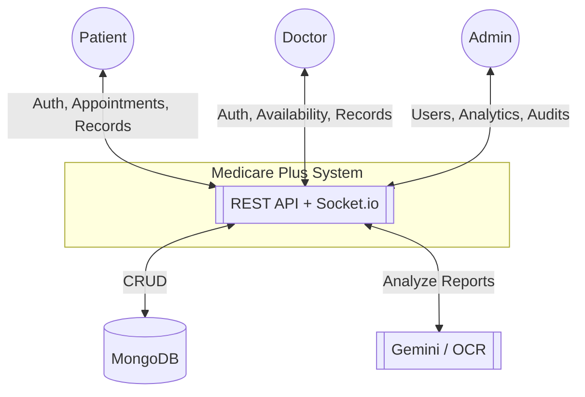
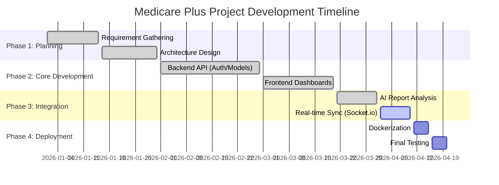
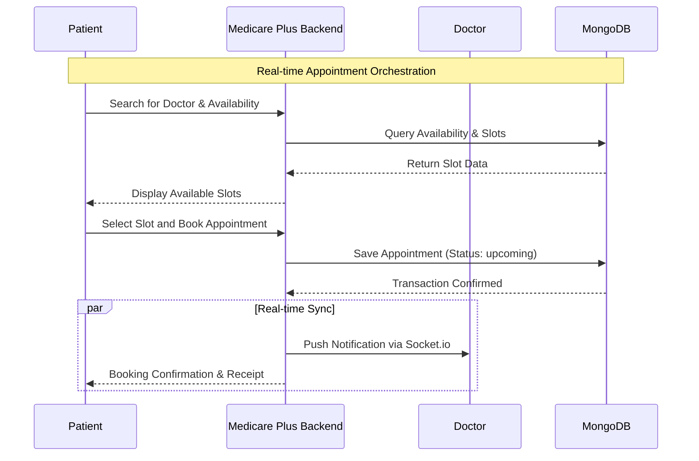
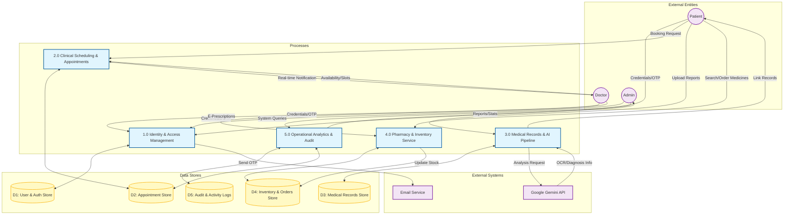
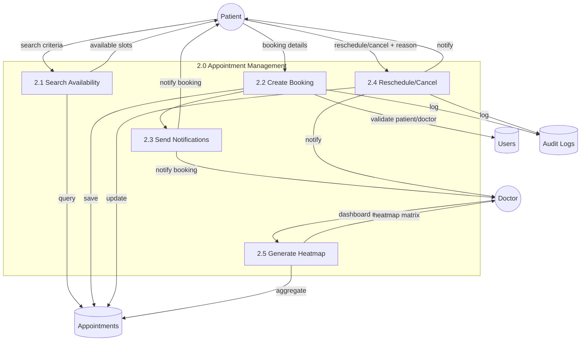

# Software Requirements Specification (SRS)
## Project: Medicare Plus (Healthcare Appointment Management System)

---

## 1. Introduction

### 1.1 Purpose
This SRS defines the functional and non-functional requirements for the Healthcare Appointment Management System (“Medicare Plus”). It is intended for developers, testers, product owners, and stakeholders to align on scope, interfaces, constraints, and acceptance criteria.

### 1.2 Scope
Medicare Plus digitizes the patient–doctor lifecycle:
- Patient onboarding, authentication (OTP), and profile management
- Doctor management, schedules, availability, and workload analytics (heatmaps)
- Appointment booking (online/offline), reminders, rescheduling, cancellation
- AI-powered lab report analysis and medical records workflow
- Real-time updates via websockets, comprehensive audit logging

### 1.3 Definitions and Acronyms
- RBAC: Role-Based Access Control
- OTP: One-Time Password
- MFA: Multi-Factor Authentication
- PII/PHI: Personally/Protected Health Information
- DFD: Data Flow Diagram
- JWT: JSON Web Token

### 1.4 References
- Root README (run/deployment): `README.md`
- Backend README (OCR/AI setup): `backend/README.md`
- Frontend app (React + Vite): `Software-Grp-Project/`
- Docker orchestration: `docker-compose.yml`

### 1.5 Overview
Sections 2–8 cover the product perspective, users, features, interfaces, data, quality attributes, and acceptance criteria. Section 9 maps APIs and data models. Section 10–14 list assumptions, constraints, risks, verification strategy, acceptance criteria, deployment/ops, and traceability.

---

## 2. Overall Description

### 2.1 Product Perspective
- Frontend: React (Vite) SPA with patient/doctor/admin dashboards
- Backend: Node.js/Express REST API with Socket.io and MongoDB
- AI: Server endpoint(s) integrating Gemini and OCR for lab report parsing
- Deployment: Dockerized services; environment variables for config

### 2.2 Product Functions (High Level)
1) Identity and access management with OTP/MFA, sessions, and profile
2) Appointment lifecycle management with collision checks and reminders
3) AI report analysis pipeline with file upload and review workflow
4) Analytics: heatmaps and doctor stats; audit logging
5) Real-time updates for booking confirmations and dashboard refresh

### 2.3 User Classes and Characteristics
- Patient: schedules appointments, uploads reports, views records
- Doctor: manages availability, reviews AI analysis, updates prescriptions
- Admin: oversees users, departments, hospitals, and audits

### 2.4 Operating Environment
- Server: Node.js 18+, MongoDB 6+, optional Python OCR env
- Client: Modern browsers (Chrome, Edge, Firefox, Safari), responsive UI
- Network: HTTPS/TLS 1.3 in production

### 2.5 Design and Implementation Constraints
- Stateless API for horizontal scaling
- Secure file handling in `backend/uploads` (consider S3 in production)
- Rate-limiting for auth endpoints
- JWT-based auth; refresh token rotation
- Logging and PII handling in compliance with applicable regulations

### 2.6 Assumptions and Dependencies
- Email service configured for OTP and notifications
- Stable Gemini API/OCR model availability
- Timezone and locale handling on client and server
- Third-party services (SMTP, AI APIs) maintain acceptable SLAs

---

## 3. External Interface Requirements

### 3.1 User Interfaces
- Accessible, responsive dashboards for all roles
- Real-time notifications/toasts; appointment heatmap visualization
- File upload UI for reports/prescriptions; progress indicators
- WCAG 2.1 AA color contrast and keyboard navigation for all critical flows

### 3.2 Software Interfaces
- MongoDB: users, appointments, records, sessions, audit logs
- Gemini/AI service: medical report analysis
- Socket.io: bidirectional event updates

### 3.3 Communications Interfaces
- REST over HTTPS (JSON)
- WebSocket (Socket.io) over TLS
- Email (SMTP) for OTP/reset notifications
- Time synchronization via NTP (assumed at OS level)

---

## 4. System Features and Functional Requirements

### 4.1 Authentication and Account Security
- REQ-AUTH-1 RBAC must restrict endpoints to `patient`, `doctor`, `admin`.
- REQ-AUTH-2 OTP verification during registration and sensitive actions.
- REQ-AUTH-3 Rate-limit sensitive auth routes.
- REQ-AUTH-4 Account lock after 5 failed logins; `lockUntil` controls unlock.
- REQ-AUTH-5 Refresh token rotation; revoke on logout or anomaly.
- REQ-AUTH-6 Profile view/update for authenticated users.
- REQ-AUTH-7 Device/location change should trigger security notification; optionally require re-auth.

### 4.2 Appointment Management
- REQ-APPT-1 Create bookings with unique `appointmentId`.
- REQ-APPT-2 Modes: `Online` (video) and `Offline` (in-clinic).
- REQ-APPT-3 Statuses: `upcoming`, `completed`, `cancelled`; rescheduling requires reason.
- REQ-APPT-4 Patient can view “my appointments”.
- REQ-APPT-5 Heatmap endpoint returns 7×24 density matrix.
- REQ-APPT-6 Urgent flag `isUrgent` to prioritize queueing.
- REQ-APPT-7 Send reminders at 24h and 2h (idempotent flags).
- REQ-APPT-8 Collision detection for overlapping doctor slots must prevent double-booking.
- REQ-APPT-9 Cancellation policy windows and reasons must be recorded.

### 4.3 Medical Records and AI Analysis
- REQ-MR-1 Patients can access their own records; doctors/admins can access authorized patient records.
- REQ-MR-2 Upload lab report files; server stores metadata and path/URL.
- REQ-MR-3 AI analysis extracts structured insights, stored in `analysis`.
- REQ-MR-4 Records lifecycle: `pending` → `reviewed` → `archived`.
- REQ-MR-5 Doctors can add comments and upload prescriptions tied to a record.
- REQ-MR-6 File size/type validation; store original filenames and generated names.
- REQ-MR-7 Only authorized roles may alter `doctorComments` and prescription fields.

### 4.4 Analytics and Audit
- REQ-AN-1 Provide overall stats and per-doctor stats.
- REQ-AUD-1 Log key actions with categories: `AUTH`, `APPOINTMENT`, `USER`, `ADMIN`, `SYSTEM`.
- REQ-AUD-2 Capture metadata (ipAddress, userAgent, timestamps).
- REQ-AUD-3 Tamper-evident logs are retained for minimum 180 days.

---

## 5. Data Requirements

### 5.1 Core Data Models (from backend/src/models)
- User: identity, role, security fields (isVerified, failedLoginAttempts, knownLocations, refreshToken)
- Appointment: linkage between patient and doctor, schedule, mode, status, reminders, urgency
- MedicalRecord: file metadata, AI `analysis`, comments, status, prescription metadata
- AuditLog, Session, OtpToken, Department, Hospital, Availability, Medicine, Order (as applicable)

### 5.2 Data Quality and Validation
- Required fields enforced via Mongoose schemas
- Unique constraints (email, appointmentId)
- Server-side validation of enums and file sizes (Multer limits)
- Canonical formats for dates/times (ISO 8601, UTC)
- Email/phone normalization and validation

### 5.3 Privacy and Retention
- Encrypt in transit; consider at-rest encryption and key rotation
- Define retention for audit logs and archived medical records
- Access to PHI audited; minimum access principle enforced

---

## 6. Non‑Functional Requirements

### 6.1 Security
- TLS 1.3 for all external traffic
- Hash passwords with bcrypt (≥ 10 salt rounds)
- Enforce least-privilege RBAC and rate-limiting
- Sanitize uploads and validate MIME types; virus/malware scanning recommended
- CSRF protection for state-changing browser interactions where applicable
- Content Security Policy and secure headers on frontend/backend

### 6.2 Performance
- P95 API latency ≤ 300ms under normal load
- Heatmap and “my appointments” queries return ≤ 500ms P95
- Concurrency target: 200 RPS sustained on standard instance profile

### 6.3 Reliability and Availability
- Target 99.9% uptime
- Daily automated backups; restore tested quarterly
- Graceful degradation during partial outages (AI/report processing can queue)

### 6.4 Scalability
- Stateless API; horizontal scaling via containers
- Externalize file storage to S3-compatible service for scale
- Caching layer (future) for read-heavy endpoints (e.g., doctor listings)

### 6.5 Observability
- Structured logging (JSON) with correlation IDs
- Metrics: request rate, latency, error rate, job success/fail counts
- Alerts on auth anomalies and elevated error rates
- Distributed tracing for critical flows (auth, booking, AI analysis)

---

## 7. Use Cases and Acceptance Criteria

### UC-1: Patient registers and verifies account
- Trigger: New user registers
- Main Flow: Submit email/password → receive OTP → verify
- Acceptance:
  - A1: Unverified users cannot access protected endpoints
  - A2: On correct OTP, `isVerified = true`
  - A3: Rate limit enforced on OTP requests and verifications

### UC-2: Patient books an appointment
- Trigger: Patient selects doctor and slot
- Main Flow: Create appointment → receive confirmation → real-time update to doctor
- Acceptance:
  - A1: Appointment stored with unique `appointmentId`
  - A2: Doctor dashboard shows booking in real-time
  - A3: Collision detection prevents double-booking; returns 409 on conflict

### UC-3: Doctor reviews AI-analyzed report
- Trigger: Patient uploads report; AI analysis available
- Main Flow: Doctor opens record → reviews `analysis` → adds comments → optionally uploads prescription → marks reviewed
- Acceptance:
  - A1: Record status transitions from `pending` to `reviewed`
  - A2: Prescription metadata linked to the record
  - A3: Only doctor/admin roles can change clinical fields; access is audited

---

## 8. System Workflow and Diagrams

### 8.0 Context Diagram (DFD Level 0)

### 8.1 Timeline (Gantt)

### 8.2 Appointment Booking (Sequence)

### 8.3 Data Flow Diagram (Level 1)
The following Level 1 DFD breaks down the Medicare Plus system into its core functional processes, illustrating how data flows between external entities, major processes, and persistent data stores.

> [!NOTE]
> **Docker Inclusion Policy**: This DFD focuses on the **logical data flow** of the application. Infrastructure components like **Docker** are not included here as they pertain to the physical deployment layer and container orchestration rather than the logical movement of system information.

### 8.4 DFD Level 2: Appointment Management

---

## 9. Detailed Specifications

### 9.1 API Endpoints (from backend/src/routes)
- Auth (`/api/auth`)
  - POST `/register`, `/verify-otp`, `/resend-otp`, `/login`, `/logout`, `/forgot-password`, `/reset-password`, `/verify-mfa`
  - POST `/refresh-token`
  - GET `/doctors` (public), `/profile` (auth), `/sessions` (auth)
  - PUT `/profile` (auth)
- Appointments (`/api/appointments`)
  - POST `/book-appointment` (auth)
  - GET `/my-appointments` (auth), `/heatmap` (auth)
  - CRUD: `POST /`, `GET /`, `GET /:id`, `PUT /:id`, `DELETE /:id`
  - Status: `PUT /:id/accept|reject|complete`, `PUT /:id/reschedule`
- AI Analysis (`/api/ai`)
  - POST `/analyze` (auth, multipart `report`)
- Medical Records (`/api/medical-records`)
  - GET `/my-records` (auth patient)
  - GET `/doctor-records` (auth doctor)
  - GET `/patient/:patientId` (auth doctor/admin)
  - PATCH `/:id` (auth doctor/admin)
  - PATCH `/:id/prescription` (auth doctor, multipart `prescription`)
  - POST `/upload-report` (auth doctor, multipart `report`)
  - PATCH `/:id/prescription-details` (auth doctor)
- Analytics (`/api/analytics`)
  - GET `/stats`, `/doctor/:doctorName`, `/doctor/id/:doctorId`

AuthN/Z:
- JWT bearer tokens on protected endpoints; role checks where noted.
- Rate limiter on sensitive auth routes.
- File uploads via Multer with size limits (10 MB for AI route).

### 9.2 Data Dictionary (selected fields)
- User: `role ∈ {patient, doctor, admin}`, `isVerified:Boolean`, `failedLoginAttempts:Number`, `lockUntil:Date`, `knownLocations:[String]`
- Appointment: `mode ∈ {Online, Offline}`, `status ∈ {upcoming, completed, cancelled}`, `reminder24hSent:Boolean`, `reminder2hSent:Boolean`
- MedicalRecord: `status ∈ {pending, reviewed, archived}`, `analysis:Mixed`, `prescriptionUrl:String`
- AuditLog: `category ∈ {AUTH, APPOINTMENT, USER, ADMIN, SYSTEM}`, `ipAddress:String`, `userAgent:String`, `timestamp:Date`

### 9.3 Error Handling
- Consistent JSON error format: `code`, `message`, `details?`
- 400 validation errors; 401/403 auth/authorization; 404 not found; 409 conflicts; 500 server
- Include correlation ID in responses for tracing

---

## 10. Constraints, Risks, and Mitigations
- File storage on local disk in development; risk of disk saturation → use S3/MinIO in prod
- AI dependency downtime → queue requests and provide fallback/manual upload path
- PHI/PII handling → encrypt in transit; restrict access via RBAC and audit access
- Timezone drift → store timestamps in UTC; convert on client
- Rate-limiting tuning → balance user experience vs. abuse prevention

---

## 11. Verification and Validation
- Unit tests for controllers/services (happy-path and edge cases)
- API contract tests (request/response schemas)
- E2E tests (Cypress) for booking and records workflows
- Security tests: auth brute-force, token reuse, upload validation
- Load tests for key endpoints; chaos testing for resilience

---

## 12. Acceptance Criteria Summary
- Auth: verified users can login; locked accounts respect `lockUntil`; refresh rotation enforced
- Appointments: unique `appointmentId`; heatmap returns 7×24 matrix; reminders set flags
- Medical Records: AI `analysis` saved; status transitions enforce rules; prescriptions attach correctly
- Analytics: doctor and global stats return expected aggregates
- Audit: critical actions recorded with IP/UA; retention policy applied

---

## 13. Deployment and Operations
- Dockerized services; `docker-compose up --build` boots frontend/backend
- Environment variables: `PORT`, `EMAIL`, `EMAIL_PASS`, DB connection, AI keys
- Logging: structured server logs; consider centralization (ELK/CloudWatch)
- Backups: daily Mongo backups; restore runbooks documented
- Health checks: `GET /` and `/health` endpoints monitored

---

## 14. Traceability (excerpt)
- REQ-AUTH-1 → Auth middleware + route guards; tests: auth access matrix
- REQ-APPT-5 → GET `/api/appointments/heatmap`; tests: matrix shape/values
- REQ-MR-3 → POST `/api/ai/analyze`; tests: analysis schema presence
- REQ-AUD-1 → Audit logger middleware; tests: log entries on sensitive actions

---

End of SRS.

